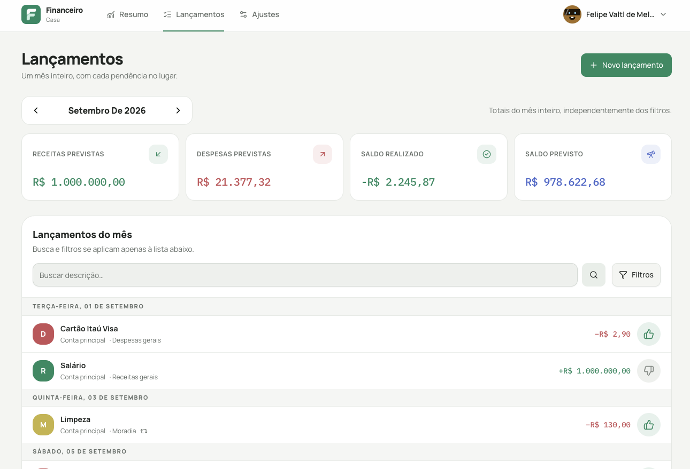

# Financeiro

Gerenciador financeiro pessoal **open source**, feito para rodar **no seu servidor**. Os lançamentos não vão para a nuvem de ninguém.

O app existe para responder duas perguntas, sem atrito: o que está previsto para o mês, e o que já recebeu o joinha de pago ou recebido.

[](https://github.com/valtlfelipe/financeiro/actions/workflows/ci.yml)
[](https://github.com/valtlfelipe/financeiro/releases)
[](LICENSE)



*Conta de demonstração com dados fictícios.*

## Sumário

- [Para quem é](#para-quem-é)
- [O que você consegue fazer](#o-que-você-consegue-fazer)
- [Instalar no seu servidor](#instalar-no-seu-servidor)
- [Atualizar](#atualizar)
- [Backup e restauração](#backup-e-restauração)
- [Desenvolvimento](#desenvolvimento)
- [Contribuir](#contribuir)
- [Licença](#licença)

## Para quem é

Para quem quer acompanhar o mês em casa, no NAS ou num VPS, sem fintech e sem planilha compartilhada.

O Financeiro **não** conecta no seu banco. Você registra as contas, as categorias e os lançamentos. O primeiro usuário nasce em `/setup`; depois disso não existe cadastro público.

## O que você consegue fazer

- criar o proprietário e o primeiro espaço financeiro
- convidar outras pessoas, com papéis de proprietário ou membro
- organizar contas e categorias, inclusive arquivadas
- lançar receitas, despesas e transferências, com valores em centavos
- repetir lançamentos por semana, mês ou ano
- parcelar de 2 a 120 vezes, sem perder centavos
- marcar pendente ou realizado com joinha, e desfazer se clicar errado
- ver o resumo do mês previsto e realizado
- instalar como PWA; os dados financeiros sempre vêm da rede, nunca de cache local

Idioma da interface: português brasileiro. A stack é Laravel 13, PHP 8.5, Inertia 3, Vue 3, PostgreSQL 17 e FrankenPHP. Não usa Redis.

## Instalar no seu servidor

Não precisa clonar o repositório nem de PHP na máquina. O Laravel em produção lê **variáveis de ambiente do processo** (Portainer, Dockhand ou o Compose). Não use um `.env` dentro do container.

O setup básico tem **três valores**: `APP_KEY`, `DB_PASSWORD` e `APP_URL`. Os dois primeiros são segredos obrigatórios; o terceiro é o endereço pelo qual você acessa o app (padrão `http://localhost:8080`). O nome do produto é sempre **Financeiro**: não existe configuração de marca ou nome para o frontend.

Gere os segredos uma vez e **não troque** a `APP_KEY` depois, senão sessões e dados criptografados quebram.

```bash
echo "base64:$(openssl rand -base64 32)"
openssl rand -hex 24
```

A primeira linha é a `APP_KEY`. A segunda, a `DB_PASSWORD`. Os comandos acima geram valores seguros para a interpolação do Compose.

### Portainer ou Dockhand

1. Crie uma stack / compose.
2. Cole o conteúdo de [`compose.yaml`](compose.yaml) (ou baixe [o arquivo raw](https://raw.githubusercontent.com/valtlfelipe/financeiro/main/compose.yaml)).
3. Defina as variáveis da stack:

| Variável | Exemplo |
| --- | --- |
| `APP_KEY` | `base64:...` gerada acima |
| `DB_PASSWORD` | senha gerada acima |
| `APP_URL` | `http://192.168.1.10:8080` ou `https://financeiro.exemplo.com` |

4. Faça o deploy.
5. Abra `/setup` na URL e crie o proprietário.

O container aplica as migrações sozinho na subida. O `scheduler` espera o `app` ficar saudável.

Sem outras variáveis, a porta publicada é `8080`, banco e usuário do PostgreSQL são `financeiro`, a interface usa português brasileiro e não há dependência de Redis ou serviço de e-mail. As exceções ficam nas opções avançadas abaixo.

### Docker Compose na linha de comando

Baixe só o compose e exporte as variáveis (não precisa de arquivo `.env`):

```bash
curl -fsSL -o compose.yaml https://raw.githubusercontent.com/valtlfelipe/financeiro/main/compose.yaml

export APP_KEY='base64:cole-aqui'
export DB_PASSWORD='cole-aqui'
export APP_URL='http://localhost:8080'

docker compose pull
docker compose up -d
```

Se estiver usando um clone, o caminho mais curto é:

```bash
./scripts/init-env.sh
# Edite somente APP_URL no .env, se necessário.
docker compose up -d
```

O script cria o `.env` mínimo, gera os dois segredos sem imprimi-los e restringe a leitura ao proprietário do arquivo. Rodá-lo novamente preserva os valores existentes. Esse `.env` serve apenas para o Compose e não entra no container. Não use o `.env` de produção para desenvolvimento local; use o exemplo específico abaixo.

Abra [http://localhost:8080/setup](http://localhost:8080/setup). Healthcheck: `/up`. Para parar: `docker compose down`. Os volumes `postgres_data` e `app_storage` permanecem; `docker compose down -v` apaga os dados.

### Opções avançadas (somente se precisar)

| Variável | Função |
| --- | --- |
| `APP_PORT` | Porta publicada no host. Padrão `8080`. |
| `DB_DATABASE` / `DB_USERNAME` | Padrão `financeiro`; úteis para manter uma instalação existente. |
| `FINANCEIRO_IMAGE` | Imagem. Padrão `ghcr.io/valtlfelipe/financeiro:latest`. Pin: `ghcr.io/valtlfelipe/financeiro:1.0.0`. |
| `TRUSTED_PROXIES` | IPs ou redes do proxy, separados por vírgula. |
| `APP_DEBUG` / `LOG_LEVEL` | Diagnóstico. Padrões `false` e `error`. Não habilite debug em uma instalação pública. |
| `MAIL_MAILER` | Padrão `log`. |

### Atrás de um proxy reverso

Coloque HTTPS na frente da porta `8080` e defina:

```env
APP_URL=https://financeiro.exemplo.com
TRUSTED_PROXIES=10.0.0.0/8,172.16.0.0/12,192.168.0.0/16
```

Ajuste `TRUSTED_PROXIES` para o endereço real do proxy, se ele não estiver nessas redes.

## Atualizar

```bash
docker compose pull
docker compose up -d
```

As migrações rodam de novo na subida, de forma idempotente. Faça backup antes de atualizar em produção.

## Backup e restauração

Num clone com Compose, o dump vai para `./backups`, fora do volume do PostgreSQL:

```bash
scripts/backup.sh
scripts/backup.sh /caminho/externo/financeiro
```

No Portainer, use o console do container `db` com `pg_dump -Fc` (mesmo formato) e baixe o arquivo.

O arquivo é um archive custom do `pg_dump`, próprio para `pg_restore`. A restauração apaga os objetos atuais do banco e por isso pede um sinal explícito:

```bash
scripts/restore.sh /caminho/financeiro-20260901T120000Z.dump --yes
```

Restaure só de arquivos confiáveis. Para validar sem risco, restaure numa instalação nova e vazia.

## Desenvolvimento

Para contribuir com código, o Laravel e o Vite rodam na máquina. O Compose sobe só a infraestrutura. Requer PHP 8.5, Composer 2 e Node.js 24. Redis é opcional nesta versão.

```bash
cp .env.development.example .env
docker compose -f compose.dev.yaml up -d

composer install
npm install
php artisan key:generate
php artisan migrate
composer dev
```

A app fica em `http://localhost:8000`. O PostgreSQL de desenvolvimento escuta em `127.0.0.1:5433`. A aplicação e o Compose usam as mesmas variáveis `DB_PORT` e `DB_PASSWORD` do `.env`; banco e usuário já têm o padrão `financeiro`. Para desligar: `docker compose -f compose.dev.yaml down`.

Redis não sobe por padrão. Para testar uma integração que precise dele, use `docker compose -f compose.dev.yaml --profile redis up -d`. Instalações de desenvolvimento que personalizavam `DEV_DB_*` ou `DEV_REDIS_PORT` devem usar as correspondentes `DB_*` ou `REDIS_PORT`.

Verificações:

```bash
vendor/bin/pint --test
vendor/bin/phpstan analyse
php artisan test --compact
npm run ci
```

Novas strings da interface entram nos catálogos, nunca soltas no Vue ou no PHP. Veja [docs/localization.md](docs/localization.md).

## Contribuir

Leia [CONTRIBUTING.md](CONTRIBUTING.md) antes de abrir um pull request e [SECURITY.md](SECURITY.md) para reportar vulnerabilidades.

Bugs e ideias vão em [issues](https://github.com/valtlfelipe/financeiro/issues). Issues curtas ajudam antes de mudanças grandes de domínio ou de interface. Preservar o isolamento por `workspace_id` é regra.

## Licença

Copyright (C) 2026 contributors. Distribuído sob a [GNU Affero General Public License v3.0](LICENSE). Se você modificar o Financeiro e oferecer a versão alterada em rede, precisa disponibilizar o código-fonte correspondente.
